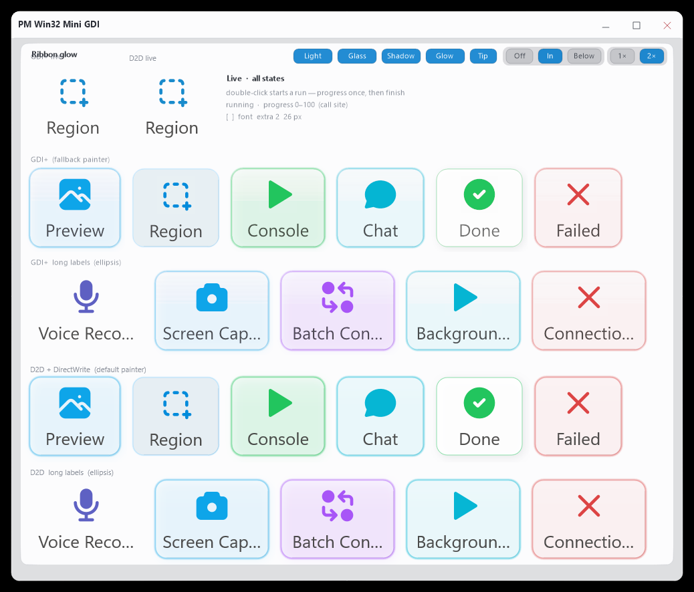

# win32-mini-gdi



Reference Win32 desktop app: **borderless chrome**, **DWM hints**, **per-pixel alpha via `UpdateLayeredWindow`**, a **custom caption** (min / max / close), a **Direct2D + WIC filmstrip**, and a **ThorVG SVG glow playground**.

This folder is the whole project. It does not depend on pixlwiz, `pm-image`, libvips, or any other product SDK. System APIs plus two vendored trees:

| Vendor | Role | Path |
|--------|------|------|
| [ThorVG](https://github.com/thorvg/thorvg) 1.0.4 | CPU SVG raster for icon buttons | `vendor/thorvg/` |
| [Tabler Icons](https://github.com/tabler/tabler-icons) (filled) | SVG sources at compile time | `vendor/tabler-icons/icons/filled/` |

## Requirements

- Windows 10/11
- CMake 3.20+
- MSVC (Visual Studio 2019+ or Build Tools) with the C++ desktop workload
- Optional: Node.js, only for the `npm` wrappers below
- If `cmake` cannot find the compiler, use an **x64 Native Tools** Developer Command Prompt

## Build

From this directory:

```bash
npm run build
npm start
```

Or CMake only:

```bash
cmake --preset win32-mini-gdi
cmake --build --preset win32-mini-gdi
.\dist\pm-win32-mini-gdi.exe
```

Debug preset: `npm run build:debug` / `cmake --preset win32-mini-gdi-debug`.

Output is always `dist/pm-win32-mini-gdi.exe`. Build trees are `build/` (Release) and `build-debug/`.

Filmstrip: pass a folder of `.jpg` / `.png` files:

```bash
.\dist\pm-win32-mini-gdi.exe --src C:\Photos
```

`--source` is an alias. Paths are resolved against the current working directory.

## Layout

```
CMakeLists.txt          standalone executable + ThorVG static lib
CMakePresets.json       win32-mini-gdi / win32-mini-gdi-debug
package.json            npm run build | start | clean
cmake/thorvg_static.cmake
main.cpp                layered shell, caption, DWM, host wiring
AppDefaults.*           HKCU window placement
SandboxLook.hpp         glass / light / shadow flags
filmstrip/              Direct2D + WIC thumbnail dock
glowplay/               D2D ribbon + ThorVG Tabler icons
docs/                   filmstrip integration + layout math
vendor/thorvg/
vendor/tabler-icons/
```

## Architecture (`main.cpp`)

- **Window**: `WS_POPUP` with `WS_SYSMENU`, min/max boxes; **no** `WS_CAPTION` / `WS_THICKFRAME` (avoids thick DWM frame lines; resize is synthetic).
- **Extended style**: `WS_EX_APPWINDOW | WS_EX_LAYERED`.
- **Presentation**: Off-screen **32 bpp top-down DIB** (`CreateDIBSection`) + **GDI+** into that DC, then [`UpdateLayeredWindow`](https://learn.microsoft.com/en-us/windows/win32/api/winuser/nf-winuser-updatelayeredwindow) with **PARGB** / `ULW_ALPHA`. **`SetLayeredWindowAttributes(LWA_ALPHA)`** is intentionally not used for the main surface (fewer redraw / trail issues when the client is constantly re-uploaded).
- **Shape**: Rounded shell via `GraphicsPath` + `FillPath`; pixels **outside** the path are cleared to **α = 0** so the HWND does not show square opaque corners (tradeoff: tiny corner wedges can be **click-through** because hit-testing follows alpha on layered windows).
- **DWM**: `DwmExtendFrameIntoClientArea` (zero margins), `DWMWA_NCRENDERING_POLICY` = disabled, border color none where supported, rounded-corner preference hint. Experiment host, not a claim of DWM parity on every OS build.
- **Caption**: Owner-drawn strip + `WM_NCHITTEST` returns `HTCAPTION` / `HTMINBUTTON` / `HTMAXBUTTON` / `HTCLOSE`. **`DefWindowProc` does not reliably perform system NC actions** on this borderless popup style, so **`WM_NCLBUTTONDOWN`** is handled explicitly (`PostMessage(WM_SYSCOMMAND, SC_*)` / close path).
- **Fonts on the bitmap**: **Do not use GDI `DrawText` on the 32 bpp DIB** for content that must appear above the desktop: GDI often leaves **alpha = 0**, which reads as fully transparent holes once the bitmap is sent through `UpdateLayeredWindow`. Use **GDI+** (`DrawString` + `SolidBrush` with explicit **A** in the color).
- **Placement**: `AppDefaults` stores `WINDOWPLACEMENT` under `HKCU\Software\Polymech\Win32Mini` and relocates if the saved monitor is gone.

Filmstrip and glow playground paint into the same layered DIB. See `docs/filmstrip.md` and `docs/layout.md`.

## Findings

### 1. `UpdateLayeredWindow` and real `WS_CHILD` controls on the same HWND

A layered top-level window driven **only** by `UpdateLayeredWindow` is effectively **one composited bitmap**. **Standard child controls parented to that same HWND** (`BUTTON`, `EDIT`, `STATIC`, …) often **do not appear** or do not composite as expected: they are still there for the message pump in many cases, but **they are not a reliable visual layer on top of the ULW surface**. Per-child **`WS_EX_LAYERED` + `SetLayeredWindowAttributes(LWA_ALPHA)`** was tried and **still did not produce a stable visible UI** in this experiment.

**Practical pattern that works:** host “real” UI on a **separate non-layered `WS_POPUP`** whose **owner** is the glass window. Position that popup in **screen space** over the region of interest (`MapWindowPoints` from the owner’s client). Children of **that** popup use the normal Win32 painting model.

### 2. Layered hit-testing vs geometry

With **α = 0** outside the rounded path, **resize edges** and **caption** logic use **window-rect math** in `WM_NCHITTEST`; do not assume the user can grab a **transparent** outer wedge — those pixels may fall through to windows below.

### 3. Distance from stock Win32 chrome

You are only a **policy / compositing** choice away from a normal titled window (`WS_OVERLAPPEDWINDOW`, default NC). The hard parts here are **custom NC + resize**, **DWM interaction**, and **layered presentation**, not a different platform.

## Leaving as its own repo

This tree is already self-contained. To split it out:

```bash
# from the parent monorepo, or copy this folder
git init
git add .
git commit -m "Initial import of win32-mini-gdi"
```

Nothing above this directory is required at configure or link time. Keep `vendor/` as-is (or replace with git submodules of the same trees).

While it still lives inside pixlwiz, `npm run build:win32-mini` from the monorepo root configures and builds this tree (output still `apps/win32-mini-gdi/dist/`).

## License

App sources: MIT (see `LICENSE`).

Vendored:

- ThorVG — MIT (`vendor/thorvg/LICENSE`)
- Tabler Icons — MIT (`vendor/tabler-icons/LICENSE`)

## References

- [UpdateLayeredWindow](https://learn.microsoft.com/en-us/windows/win32/api/winuser/nf-winuser-updatelayeredwindow)
- [Layered windows](https://learn.microsoft.com/en-us/windows/win32/winmsg/window-features#layered-windows)
- [Custom frame (DWM)](https://learn.microsoft.com/en-us/windows/win32/dwm/customframe)
- [`DWMWINDOWATTRIBUTE`](https://learn.microsoft.com/en-us/windows/win32/api/dwmapi/ne-dwmapi-dwmwindowattribute)
